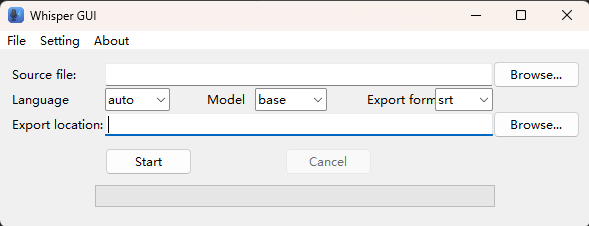

# Whisper GUI

<p align="center">
  
</p>


<p align="center">
    <a href="https://github.com/TBSKBJustin/WhisperGUI/stargazers" style="text-decoration:none" >
        
    </a>
    <a href="https://github.com/TBSKBJustin/WhisperGUI/network" style="text-decoration:none" >
        
    </a>
    <a href="https://github.com/TBSKBJustin/WhisperGUI/issues" style="text-decoration:none">
        
    </a>
    <a href="https://github.com/TBSKBJustin/WhisperGUI/blob/main/LICENSE" style="text-decoration:none" >
        
    </a>
</p>

> 🇺🇸 English Documentation (current) | 📘 [简体中文](./README_zh.md)

**Whisper GUI** is a lightweight desktop application for transcribing audio and video files using OpenAI's Whisper model — no command-line knowledge required.

- 🎧 Supports MP4, MP3, WAV, FLAC, M4A, and more
- 🌍 Multilingual: Choose transcription language + subtitle format (TXT/SRT/VTT)
- 🧠 Model selection (tiny → large) for speed vs. accuracy
- ⚡ GPU or CPU selectable during installation
- 📦 Lightweight installer (under 30MB) downloads only what you need

---

## 💻 System Requirements

- Windows 10 or 11 (64-bit)
- Internet connection (for one-time dependency download)
- Python 3.10 – 3.13 [Python](https://www.python.org/downloads/)
- Pip command support `Installed with Python`
- Git command support [Git](https://git-scm.com/)
- [Optional] NVIDIA GPU with CUDA 11.8+ for GPU acceleration [Cuda](https://developer.nvidia.com/cuda-toolkit)

---

## 🚀 Installation

1. **Download** the latest `WhisperGUI_Installer.exe` from [Releases](https://github.com/TBSKBJustin/WhisperGUI/releases)

<p align="left">
    <a href="https://github.com/TBSKBJustin/WhisperGUI/releases/latest" style="text-decoration:none">
       
    </a>
    <a href="https://github.com/TBSKBJustin/WhisperGUI/releases/latest" style="text-decoration:none">
       
    </a>
    <a href="https://github.com/TBSKBJustin/WhisperGUI/releases" style="text-decoration:none">
       
    </a>
</p>

2. Run the installer:
   - Select UI language (English / 简体中文)
   - Choose installation directory
   - Choose **PyTorch version**:
     - `CPU-only` (≈1.5GB download)
     - `GPU-enabled (CUDA)` (≈6GB download; requires CUDA 11.8+)
3. Installer will:
   - Create a Python virtual environment
   - Download and install required packages (`torch`, `whisper`, `ffmpeg-python`, etc.)
4. Upon completion, launch the app from:
   - Desktop shortcut
   - Start menu
   - Or run `{InstallDir}\WhisperGUI.exe`

---

## 🧪 How to Use

<p align="center">
  
</p>

### 🧭 Instructions

1. **Select source file**  
   Click the top-right `Browse...` to select an audio or video file (e.g., `.mp3`, `.mp4`, `.wav`...).

2. **Choose transcription options**  
   - **Language**: Choose the language spoken in the file (or leave it as `auto`)
   - **Model**: Select model size (`tiny`, `base`, `small`, `medium`, `large`)
   - The model will be downloaded the first time it is used.
   - **Export format**: Choose between `.txt`, `.srt`, or `.vtt`

3. **Select export location**  
   Click the second `Browse...` to choose where the transcript or subtitles should be saved.

4. **Start transcribing**  
   Click `Start` and wait — progress will appear in the bar below. You can cancel any time.

---

## 🧠 How It Works

This GUI wraps the [OpenAI Whisper](https://github.com/openai/whisper) speech recognition model in a user-friendly interface.

- Under the hood:
  - Built with **Tkinter**
  - Whisper runs through a **dedicated Python venv**
  - Transcription output is saved to `.txt`, `.srt`, or `.vtt` formats
- No external tools needed (FFmpeg is handled via `ffmpeg-python`)

---

## ❓ FAQ

### “I get an error saying `torch` or `whisper` not found after install.”
- This likely means the install process failed.
- Please check `install_log.txt` in the installation folder.
- Ensure you have internet access during install.
- For GPU users: make sure you have CUDA 11.8 drivers installed.

### Can I run this on a machine without Python?
- Yes! The app auto-creates its own Python environment inside the install folder.
- You do not need Python pre-installed.

### Can I upgrade Whisper or PyTorch later?
- Yes, open a terminal inside `{InstallDir}\venv\Scripts\` and run:
```bash
pip install --upgrade whisper torch
```

---

## 🛠 Developer Info

- Language: Python 3.13
- GUI: Tkinter
- Installer: [Inno Setup](https://jrsoftware.org/isinfo.php)
- Launcher compiled with [PyInstaller](https://pyinstaller.org/)

---

## 📄 License

MIT License © 2024 Justin

---

## 🌟 Credits

- [OpenAI Whisper](https://github.com/openai/whisper)
- [ffmpeg-python](https://github.com/kkroening/ffmpeg-python)
- [Inno Setup](https://jrsoftware.org/)

