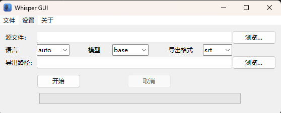

# Whisper GUI

<p align="center">
  
</p>

> 🇺🇸 [English Documentation](./README.md) | 📘 简体中文（当前）

**Whisper GUI** 是一个轻量级的桌面应用程序，使用 OpenAI 的 Whisper 模型对音频和视频文件进行转录 —— 无需任何命令行知识。

- 🎧 支持 MP4、MP3、WAV、FLAC、M4A 等格式
- 🌍 多语言支持：可选择转录语言 + 导出字幕格式（TXT/SRT/VTT）
- 🧠 模型可选（从 tiny 到 large），平衡速度与准确性
- ⚡ 安装时可选择使用 GPU 或 CPU
- 📦 安装包小于 30MB，按需下载依赖

---

## 💻 系统要求

- Windows 10 或 11（64位）
- 需联网以下载依赖（首次安装时）
- Python 3.10 – 3.13 [Python安装](https://www.python.org/downloads/)
- Pip 指令 [Pip安装](https://pip.pypa.io/en/stable/installation/)
- Git 指令 [Git安装](https://github.com/git-guides/install-git)
- 【可选】支持 CUDA 11.8+ 的 NVIDIA GPU，可加速转录

---

## 🚀 安装说明

1. **下载**最新版安装包 [`WhisperGUI_Installer.exe`](https://github.com/TBSKBJustin/WhisperGUI/releases)
2. 运行安装程序，依提示操作：
   - 选择界面语言（English / 简体中文）
   - 选择安装目录
   - 选择 PyTorch 版本：
     - `CPU-only`（≈200MB 下载）
     - `GPU-enabled (CUDA)`（≈1.5GB 下载；需安装 CUDA 11.8）
3. 安装器将自动完成以下操作：
   - 创建 Python 虚拟环境
   - 下载并安装依赖包（如 `torch`, `whisper`, `ffmpeg-python` 等）
4. 安装完成后可通过以下方式启动应用：
   - 桌面快捷方式
   - 开始菜单
   - 或运行 `{安装路径}\WhisperGUI.exe`

---

## 🧪 如何使用

<p align="center">
  
</p>

### 🧭 使用说明（中文）

1. **选择源文件**  
   点击右上角的 `Browse...`，选择你要转录的音频或视频文件（如 `.mp3`、`.mp4`、`.wav` 等）。

2. **设置转录参数**  
   - **语言（Language）**：选择音频中说的语言，或保持 `auto` 自动识别
   - **模型（Model）**：选择模型大小（`tiny`, `base`, `small`, `medium`, `large`），模型越大越准确但越慢
   - 模型将会在第一次使用时下载。
   - **导出格式（Export format）**：可选 `.txt`、`.srt` 或 `.vtt`

3. **选择导出位置**  
   点击第二个 `Browse...` 选择转录或字幕的保存路径。

4. **开始转录**  
   点击 `Start` 开始，进度条会显示处理进度。可随时点击 `Cancel` 取消。

---

## 🧠 工作原理

本图形界面封装了 [OpenAI Whisper](https://github.com/openai/whisper) 模型，简化用户操作：

- 技术实现：
  - 使用 **Tkinter** 构建图形界面
  - 使用独立的 Python 虚拟环境运行 Whisper
  - 转录结果可保存为 `.txt`、`.srt` 或 `.vtt` 格式
- 无需单独安装 FFmpeg，程序自动集成处理（使用 `ffmpeg-python`）

---

## ❓ 常见问题（FAQ）

### 安装后提示找不到 `torch` 或 `whisper`？
- 安装过程中可能出现异常，建议：
  - 检查安装目录中的 `install_log.txt`
  - 安装时保持联网
  - 若选择 GPU 版本，请确保系统已正确安装 CUDA 11.8 驱动

### 没有安装 Python，可以使用这个程序吗？
- 可以！程序会自动创建并使用自己的 Python 环境，无需系统预装 Python。

### Whisper 或 PyTorch 之后可以更新吗？
- 可以，打开 `{安装目录}\venv\Scripts\` 下的终端窗口，运行：

```bash
pip install --upgrade whisper torch
```
---

## 🛠 开发信息

- 编程语言: Python 3.13
- 图形界面: Tkinter
- 安装器: [Inno Setup](https://jrsoftware.org/isinfo.php)
- 启动器: [PyInstaller](https://pyinstaller.org/)

---

## 📄 许可证

MIT License © 2024 Justin

---

## 🌟 鸣谢

- [OpenAI Whisper](https://github.com/openai/whisper)
- [ffmpeg-python](https://github.com/kkroening/ffmpeg-python)
- [Inno Setup](https://jrsoftware.org/)